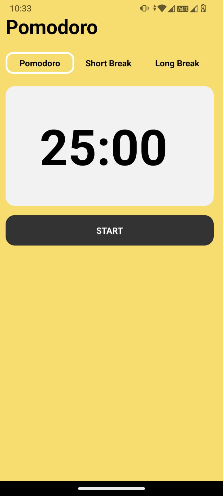
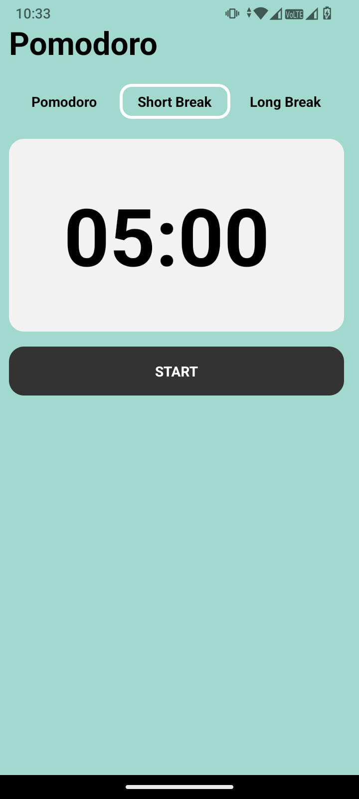
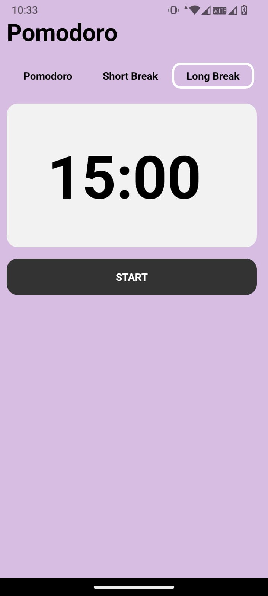

## POMODORO APP
### A pomodoro app built with React Native expo, JavaScript.

## SCREENSHOTS




## URL Ref
* https://www.youtube.com/watch?v=Dl8x8EWXq8s&t=1710s&ab_channel=ATLAcademy%28byLucasMoy%29
> minuto: 52:07

## INSTALL

```
npm install
```

## RUN

```
npx expo start
```

To run the app on a physical device, the Expo Go app must be installed on the device


